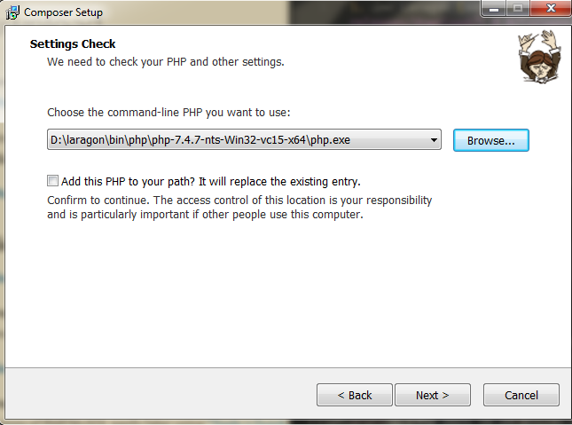
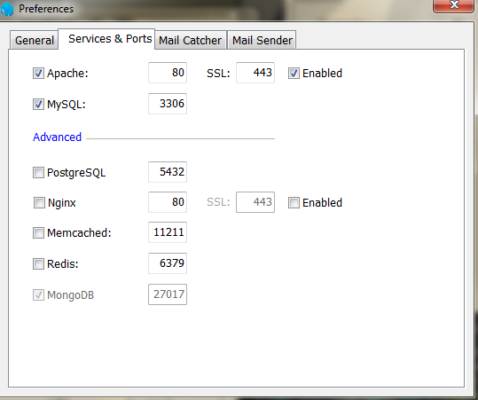
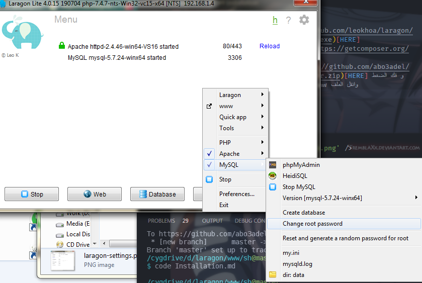
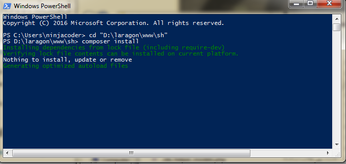

## Installation

1. تحميل Laragon (server) [HERE](https://github.com/leokhoa/laragon/releases/download/5.0.0/laragon-wamp.exe)
2. تحميل composer (Package Manager) [HERE](https://getcomposer.org/Composer-Setup.exe)

**سطب لاراجون وبعده ريستارت وبعد كده composer**

وانت بتسطب 

composer

ممكن يطلب مكان ملف 

php

اعمل زى الصورة دى مع اختلاف مكان تسطيب لاراجون وريستارت بعد التسطيب




3. تحميل البرنامج (compressed file) [HERE](https://github.com/abo3adel/shop-manager/archive/refs/heads/master.zip) و فك الضغط
4. إفتح الفولدر اللى سطبت فيه لاراجون وافتح فولدر 

```www```

 وانقل فولدر البرنامج بعد فك الضغط وسميه  
 
 ```shop```

 وافتح فولدر البرنامج وفك ضغط الملف 

 ```env.zip```

<!-- ده الملف اللى هيبقى فيه باسورد الداتابييس وحاجات تانية  -->

5. شغل لاراجون كـ أدمن و اعمل الإعدادات زى دى


---

6. إتأكد انه شغال زى كده 


7. زى الصورة اللى فاتت وإعمل 

```change root password```

 و خليها
 
  ```123 ```

8. من نفس الصورة وإعمل 

```create database```

 وسميها 
 
 ```shop```


9. وبعد كده افتح 

powershell

واعمل زى الصورة



وسيبه ينزل براحته

10. وبعد مايخلص اكتب

```php artisan migrate```

وسيبه يخلص

11. افتح المتصفح واكتب 

[http://shop.test/](http://sh.test/)


وان شاء الله يفتح البرنامج معاك

12. جرب كده ولو فيه مشكلة عرفنى وهحلهالك ف الفون ان شاء الله